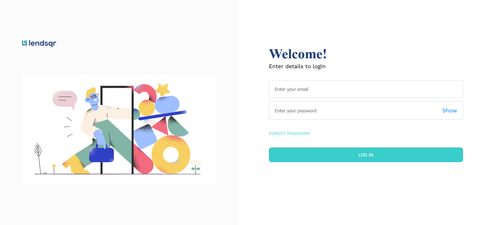
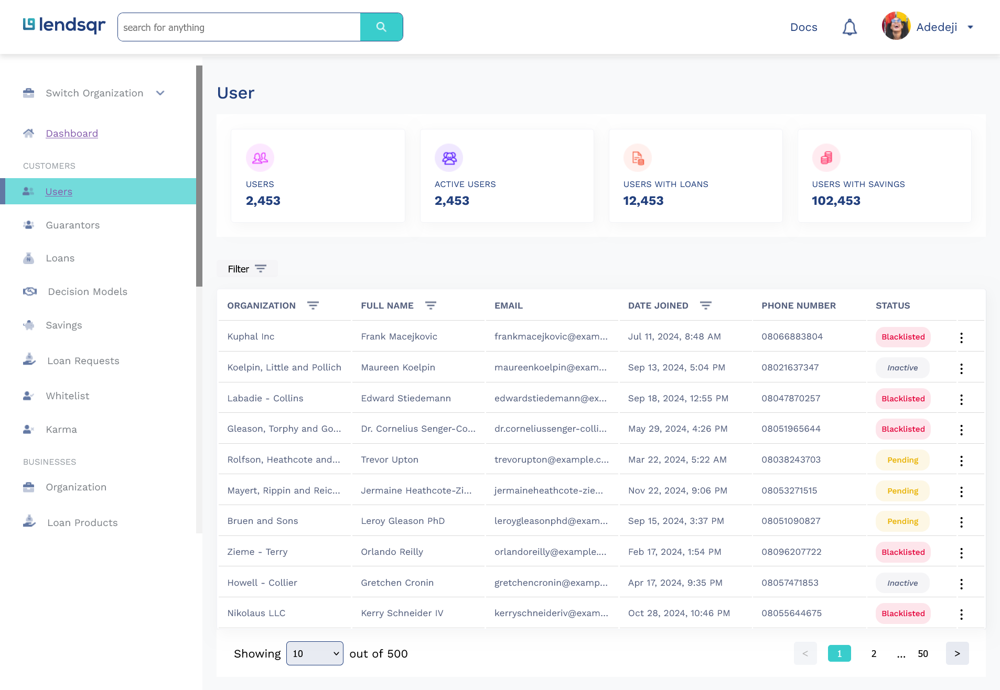
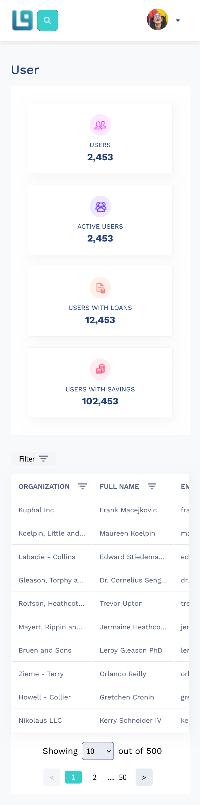
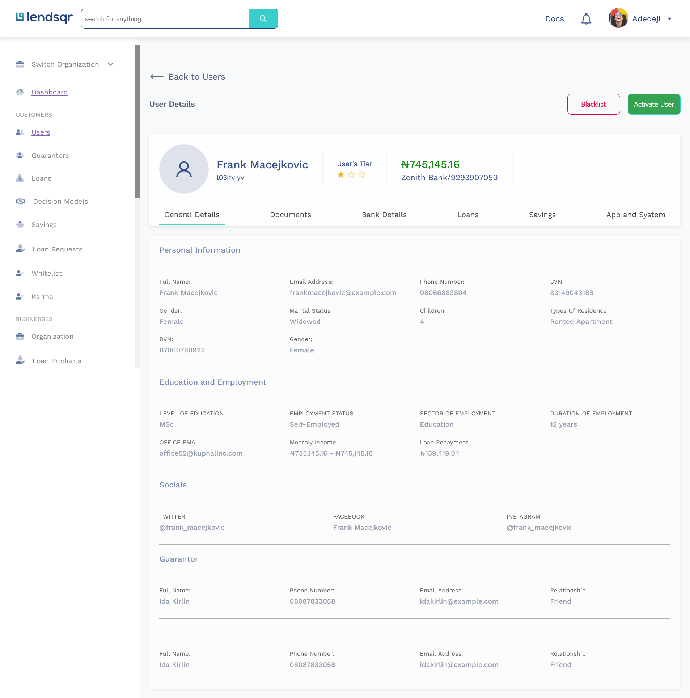
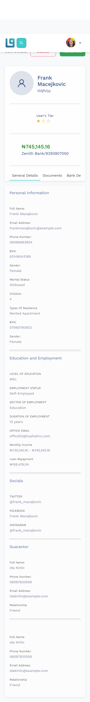

# Lendsqr Frontend Test  

<!-- Welcome to the **Lendsqr Frontend Test**! This project is a **user management dashboard** created to showcase technical skills in frontend development. The application highlights responsive design, efficient user handling, and clean code practices. It was crafted as part of a technical evaluation but is also a demonstration of how thoughtful design meets technical expertise. -->

  
  
  

This documentation outlines the implementation and design of the **Lendsqr frontend engineering project**!. Designed as a technical assessment, the project demonstrates the application of modern web development standards, effective state management, robust testing practices, and user-focused design. The primary goal was to showcase technical skills in frontend development; build a React-based application that adheres to industry best practices while maintaining scalability, maintainability, and performance.

---

## 🚀 Features  

### 🌟 Core Functionality  
- **Authentication**: A secure login system with session persistence stored in `localStorage`.  
- **User Dashboard**: Displays user data with a clean interface, including filtering and sorting.  
- **Status Indicators**: Visual cues like "Active" or "Blacklisted" badges enhance data interpretation.  
- **Responsive Design**: Fluid UI for both desktop and mobile devices.  
- **Pagination**: Elegant handling of large datasets with pagination controls.  

### ✨ Highlights  
- User interface built with **attention to detail** for seamless navigation.  
- API integrations with real-world handling of asynchronous data.  
- Scalability ensured with a well-thought-out project structure.  

---

## 🌄 Visual Walkthrough  

### 🔐 Login Page  
The login page is your gateway to the dashboard, combining simplicity with functionality.  

  
*(Mobile-friendly version shown below)*  
  

### 📊 Dashboard  
Once logged in, the dashboard showcases users with filters, sorters, and status badges.  

  
*(Mobile dashboard view)*  
  

### 📄 User Details  
Dive deeper into user profiles with detailed information.  

  
*(Optimized for responsive layouts)*  
  

Visuals provide clarity and help users anticipate how the app will look and function.

---

## 🛠️ Project Structure  

To ensure scalability and maintainability, the project follows a structured directory layout:  

```plaintext  
src/  
├── assets/             # Static assets like images, icons, styles  
├── components/         # Reusable UI components (Buttons, Modals, etc.)  
├── features/           # Feature-specific logic and modules  
├── hooks/              # Custom React hooks  
├── services/           # API handling and network requests  
├── types/              # TypeScript definitions  
├── utils/              # Utility functions and constants  
└── App.tsx             # Main application entry point  
```  

---

## 💻 Installation and Setup  

### Prerequisites  
- **Node.js** (version 16 or later)  
- **npm** or **yarn** package manager  

### Steps  

1. **Clone the Repository**  
   ```bash  
   git clone https://github.com/Harkanni/lendsqr-fe-test.git  
   cd lendsqr-fe-test  
   ```  

2. **Install Dependencies**  
   ```bash  
   npm install  
   # or  
   yarn install  
   ```  

3. **Start the Development Server**  
   ```bash  
   npm start  
   # or  
   yarn start  
   ```  

4. **Build for Production**  
   ```bash  
   npm run build  
   # or  
   yarn build  
   ```  

---

## 🧭 How to Use  

1. **Login**  
   - Navigate to `/login`.  
   - Enter valid credentials to proceed to the dashboard.  

2. **Explore the Dashboard**  
   - Browse user data.  
   - Use filters and sorters for quick navigation.  
   - Check user status through badges.  

3. **User Details**  
   - Expand rows or click to view detailed user profiles.  

---

## 🛠️ Technologies  

This project leverages modern tools and libraries:  

- **React**: Core framework for building the user interface.  
- **TypeScript**: For static typing and code reliability.  
- **SCSS**: Clean and responsive styling.  
- **TanStack Table**: Advanced table functionality for sorting and pagination.  
- **React Router**: Intuitive navigation management.  

---

## 🔮 Future Enhancements  

This project serves as a foundation, with room for more advanced features:  

- **Role-Based Access Control (RBAC)**: Enhance security with granular permissions.  
- **Dark Mode**: Introduce a dark mode toggle for better user experience.  
- **Unit and Integration Testing**: Strengthen reliability with **Jest** and **React Testing Library**.  
- **Accessibility Improvements**: Add ARIA roles and ensure keyboard navigation support.  

---

## 🙌 Contributing  

We welcome contributions! Here’s how you can contribute:  

1. **Fork the Repository**.  
2. **Create a Feature Branch**.  
   ```bash  
   git checkout -b feature-name  
   ```  
3. **Commit Your Changes**.  
   ```bash  
   git commit -m "Add meaningful message here"  
   ```  
4. **Push Your Changes**.  
   ```bash  
   git push origin feature-name  
   ```  
5. **Open a Pull Request**.  

Let’s build something amazing together!  

---

## 📜 License  

This project is licensed under the [MIT License](./LICENSE).  

---

## 👤 Author  

Developed by [Harkanni](https://github.com/Harkanni).  
For queries, feedback, or support, please open an issue or contact me directly.  
