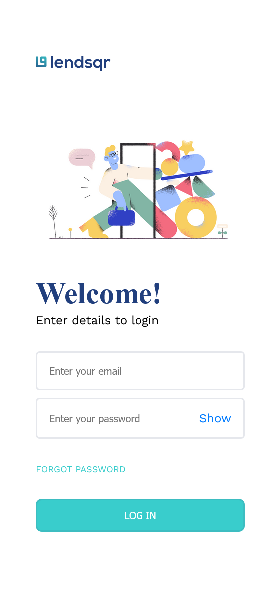

# Lendsqr Frontend Test  

  
  
  

This repository contains a frontend web application built for the Lendsqr technical test. The application is a user management dashboard with features such as authentication, user listing, pagination, and status indicators (e.g., active, blacklisted). It demonstrates clean code practices, UI responsiveness, and an organized project structure.  

---

## Features  

### Core Functionality  
- **User Management Dashboard**: Displays user data in a paginated table with sorting and filtering capabilities.  
- **Authentication**: Login functionality with session persistence using `localStorage`.  
- **Responsive Design**: Adaptable UI for both desktop and mobile screens.  
- **Status Indicators**: Users categorized as active, blacklisted, etc., with visually distinct badges.  
- **Pagination**: Intuitive pagination with ellipsis for large datasets.  

---

## Screenshots  

### Login Page  
  



### Dashboard  
  


### User Details


---

## Project Structure  

This project has been structured for maintainability and scalability:  

```plaintext  
src/  
├── assets/             # Static assets (images, icons, styles)  
│   ├── images/         # Image files  
│   ├── icons/          # Icon assets  
│   └── styles/         # SCSS or CSS files  
├── components/         # Reusable UI components (Button, Pagination, Loader, etc.)  
├── features/           # Feature-specific modules (auth, dashboard, users)  
├── hooks/              # Custom React hooks  
├── services/           # API service files for network requests  
├── types/              # Application-wide TypeScript definitions  
├── utils/              # Helper utilities and constants  
└── App.tsx             # Main application entry point  
```  

---

## Installation and Setup  

### Prerequisites  
- Node.js (version 16+)  
- npm or yarn  

### Steps  
1. **Clone the Repository**:  
   ```bash  
   git clone https://github.com/Harkanni/lendsqr-fe-test.git  
   cd lendsqr-fe-test  
   ```  

2. **Install Dependencies**:  
   ```bash  
   npm install  
   # or  
   yarn install  
   ```  

3. **Run the Application**:  
   ```bash  
   npm start  
   # or  
   yarn start  
   ```  

4. **Build for Production**:  
   ```bash  
   npm run build  
   # or  
   yarn build  
   ```  

---

## Usage  

1. **Authentication**:  
   - Navigate to `/login` and enter valid credentials.  
   - Sessions persist in `localStorage`.  

2. **Users**:  
   - View all users, their statuses, and details.  
   - Pagination controls for navigation through user data.  

3. **User Management**:  
   - Status indicators such as *active*, *pending*, or *blacklisted*.  
   - Dynamic table with expandable rows.  

---

## Technologies Used  

- **React**: For building UI components.  
- **TypeScript**: For type safety and better maintainability.  
- **SCSS**: For styling and responsive design.  
- **TanStack Table**: For efficient table data handling and pagination.  
- **React Router**: For handling navigation.  

---

## Future Improvements  

- Add role-based access control (RBAC) for advanced user management.  
- Introduce more unit tests and integration tests using **Jest** and **React Testing Library**.  
- Optimize for progressive web app (PWA) standards.  
- Enhance accessibility (ARIA roles and keyboard navigation).  
- Implement dark mode for better UX.  

---

## Contributing  

Contributions are welcome! Follow these steps to contribute:  
1. Fork the repository.  
2. Create a feature branch: `git checkout -b feature-name`.  
3. Commit changes: `git commit -m "Add a meaningful message"`.  
4. Push to your fork: `git push origin feature-name`.  
5. Open a pull request.  

---

## License  

This project is licensed under the [MIT License](LICENSE).  

---

## Author  

Developed by [Harkanni](https://github.com/Harkanni). For queries or support, feel free to reach out via GitHub Issues.  

---

